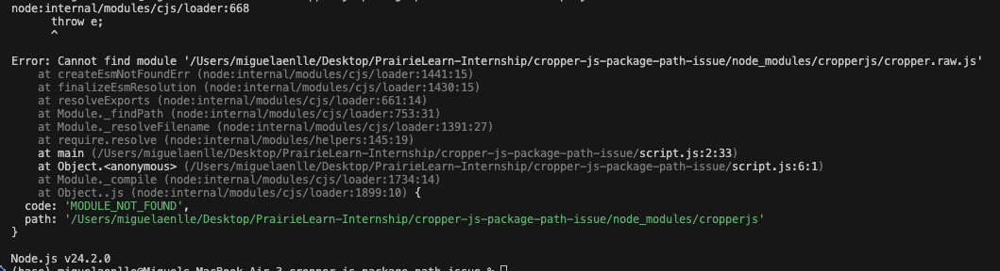

# Issue

When trying to retrieve the path to the `cropperjs` library with `require`, since the CropperJS `package.json` default CommonJS export contains a path to `./cropper.raw.js` rather than `./dist/cropper.raw.js`, this error occurs:

<!-- Display the PNG as an image -->

Adjusting this to `./dist/cropper.raw.js` fixes the issue.

Also, adding `"./package.json": "./package.json"` to the exports ensures `require('cropperjs/package.json')` (or `import pkg from 'cropperjs/package.json'`) will resolve correctly, making CropperJS's metadata (version, author, license, etc.) available to consumers and tooling.

# Demo Video
https://github.com/user-attachments/assets/64e8fc91-15fc-4fbf-8cc0-37731b80d377

# Steps to reproduce
1. Clone this repository, and navigate to `cropper-js-package-path-issue` in your terminal.
2. Run `npm install`.
3. Run `node script.js`. The issue described above should occur.
